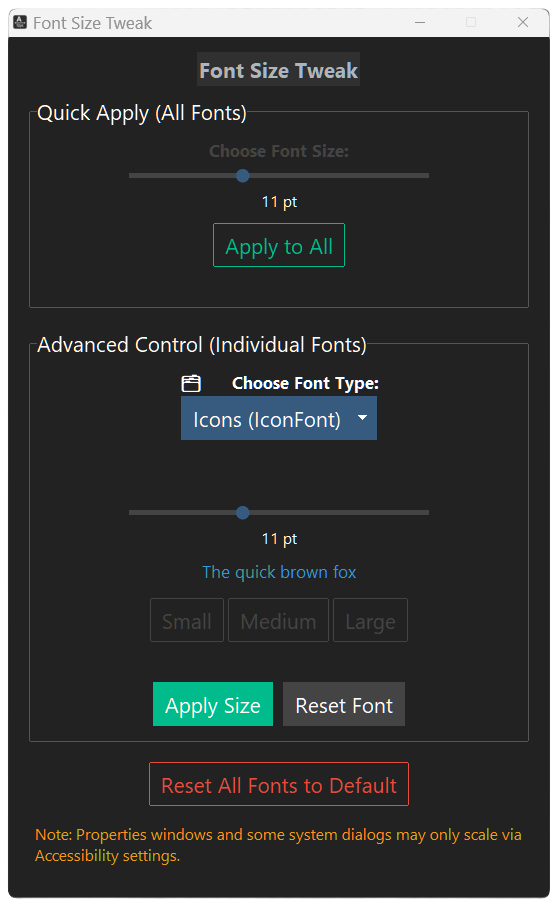

# 🪄 FontSize Tweak

A clean, dark-mode-friendly Windows utility to **tweak system font sizes** — no scaling, no DPI mess, just better readability.

Built with Python + ttkbootstrap, fully open-source and packaged as a portable `.exe`.

---

## 💾 Download

➡ [**Download the latest version**](https://github.com/uxillary/font-size-tweak/releases/tag/v1.0.0)

Just run the EXE — no installer needed.  
> ⚠️ You may need to **log out and back in** for changes to fully apply.

---

## ✨ Features

- 🧩 Per-font control (Title, Menu, MessageBox, Icon, Status)
- 🎛️ Quick apply to all fonts at once
- 🔍 Live preview + current font size detection
- 🌙 Dark mode interface with accessibility in mind
- 🧊 Portable `.exe` — no install, no background process

---

## 🧪 Developer Stuff

### Run it:

```bash
pip install ttkbootstrap
python main.py
```

### Build it (PyInstaller):

```bash
pyinstaller main.py --onefile --windowed --icon=icon.ico --name FontSizeTweak --add-data "icon.ico;."
```

---

## 📸 Screenshot



---

## ☕ Support

If this helped your eyeballs or your nan,  
consider fueling my next idea:  
[https://coff.ee/admjski](https://coff.ee/admjski)

---

## 🛠️ License

MIT License.  
Use it, fork it, remix it — just give credit.

---

## 👤 Author

**Adam Johnston**  
[GitHub](https://github.com/admjski)
