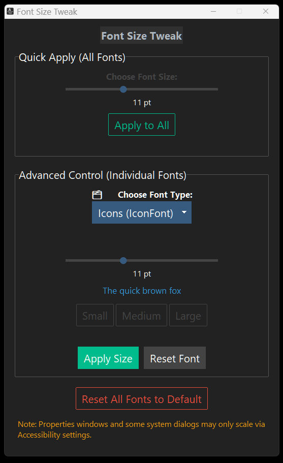

# Font Size Tweak

[](https://github.com/uxillary/font-size-tweak/releases/latest)
[](LICENSE)
[](https://uxillary.github.io/font-size-tweak/)
[](https://github.com/uxillary/font-size-tweak)

Font Size Tweak is a free, open-source Windows 10/11 utility for making supported File Explorer, menu, icon, title bar and system UI text easier to read without increasing display scaling. It is designed for the common problem where **File Explorer text is too small** or the **Windows 11 font size** is uncomfortable, but making all Windows text larger through scaling also makes everything else bigger.



## Download latest

**[Download the latest release](https://github.com/uxillary/font-size-tweak/releases/latest)**, extract it and run `FontSizeTweak.exe`.

The executable is portable: it does not require installation or administrator rights. See [all releases](https://github.com/uxillary/font-size-tweak/releases) for previous versions and release notes.

## Key features

- **Quick Apply** changes all five supported font metrics to one size.
- Individual controls cover title bars, menus, message boxes, icons and status bars.
- Current and proposed sizes are shown before an individual change is applied.
- Synchronized sliders and numeric controls allow exact sizes from 8–16 pt.
- The original raw settings are backed up persistently before the first change.
- Restore one selected original setting or all five original settings.
- **Undo Last Change** reverses the most recent apply or restore operation.
- Clear status, validation and partial-error feedback.
- Portable, no-admin-rights-required Windows executable.
- Free and open source under the [MIT Licence](LICENSE).

## Why use Font Size Tweak?

Windows display scaling is useful, but it enlarges much more than text. Font Size Tweak provides a focused way to change supported Windows font sizes without scaling the whole desktop. It can help when Windows 11 text is too small on a laptop or high-resolution display, and offers a lightweight, open-source Windows system font changer for people seeking an Advanced System Font Changer alternative focused on font size.

## How it works

Font Size Tweak reads the five supported `REG_BINARY` font values under `HKEY_CURRENT_USER\Control Panel\Desktop\WindowMetrics`. When changing a size, it preserves the existing font data and modifies only its height field. Changes may require signing out of Windows and back in before every compatible interface refreshes.

## Supported Windows versions

Font Size Tweak supports Windows 10 and Windows 11 desktop releases. It uses per-user settings, so administrator rights are not required.

## Limitations

The app changes these classic Windows metrics: `CaptionFont`, `MenuFont`, `MessageFont`, `IconFont` and `StatusFont`. Some Windows interfaces and applications use different rendering systems and may not respond to these metrics. Font Size Tweak does not claim to change every dialog, Properties window or piece of application text.

## Safety and backup

Before its first write, the app saves the complete original values for all five supported metrics to `%APPDATA%\FontSizeTweak\original-settings.json`. Restore actions use **your captured original settings**, not hard-coded Microsoft defaults. A one-level undo snapshot also protects the state immediately before the latest operation.

The app changes user registry settings, so close important work first. If you maintain your own system backups or restore points, keep using them as an additional precaution.

## Releases and previous versions

- [Latest release and download](https://github.com/uxillary/font-size-tweak/releases/latest)
- [All releases and previous versions](https://github.com/uxillary/font-size-tweak/releases)
- [Changelog](CHANGELOG.md)
- [Development roadmap](context/roadmap.md)

## Development and running from source

Python 3 with Tk support is required. On Windows:

```powershell
py -m venv .venv
.\.venv\Scripts\Activate.ps1
py -m pip install -r requirements.txt
py main.py
```

The application intentionally uses Windows registry APIs and therefore does not run on macOS or Linux.

## Support and issues

Found a bug or have a focused feature request? [Open a GitHub issue](https://github.com/uxillary/font-size-tweak/issues). You can also visit the [project website](https://uxillary.github.io/font-size-tweak/) or [support development on Buy Me a Coffee](https://coff.ee/admjski).

## Star the project

Found Font Size Tweak useful? Consider [starring the repository](https://github.com/uxillary/font-size-tweak) — it helps more people discover the project.

## Licence

Font Size Tweak is released under the [MIT Licence](LICENSE).
