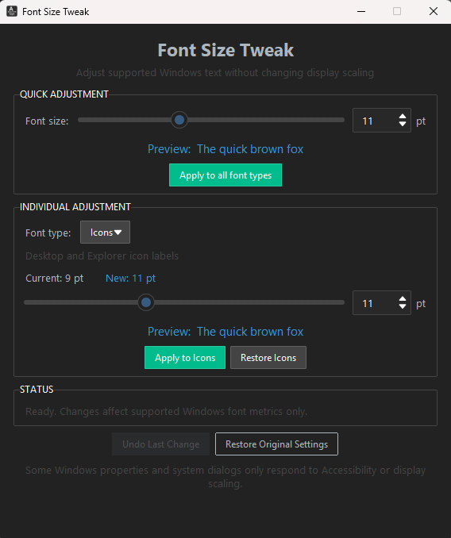

# Font Size Tweak

[](https://github.com/uxillary/font-size-tweak/releases/latest)
[](LICENSE)
[](https://uxillary.github.io/font-size-tweak/)
[](https://github.com/uxillary/font-size-tweak)

Font Size Tweak is a free, open-source utility for adjusting five classic Windows UI font metrics without changing display scaling. It is aimed at Windows 10 and Windows 11 users who want supported File Explorer labels, menus, title bars, message text or status text to be easier to read without enlarging the entire desktop.

[](docs/assets/screenshot1.png)

## Download and use

1. **[Download the latest release](https://github.com/uxillary/font-size-tweak/releases/latest)**.
2. Extract the downloaded archive.
3. Run `FontSizeTweak.exe`.
4. Choose a size from 8–16 pt and apply it to every supported metric, or select one metric under **Individual Adjustment**.
5. Sign out of Windows and back in if a compatible interface does not refresh immediately.

The executable is portable and requires neither installation nor administrator rights. The app does, however, keep its safety backup in your Windows profile; see [Backup, restore and undo](#backup-restore-and-undo).

## Current release: v1.1.0

The current interface includes:

- **Quick Adjustment** to apply one size to all five supported metrics.
- **Individual Adjustment** for title bars, menus, message boxes, icons and status bars.
- Synchronized sliders and numeric controls for exact sizes from **8–16 pt**.
- A sample-text preview of the chosen point size.
- The selected metric's current registry-derived size and proposed size.
- Persistent status, validation and partial-error feedback.
- Persistent original-settings backup, selected/all restore actions and one-level undo.

See the [changelog](CHANGELOG.md) for release history.

## What it changes

Font Size Tweak reads these `REG_BINARY` values under `HKEY_CURRENT_USER\Control Panel\Desktop\WindowMetrics`:

| App control | Registry value | Commonly affects |
| --- | --- | --- |
| Title Bar | `CaptionFont` | Classic window title text |
| Menus | `MenuFont` | Classic menu bars and context menus |
| Message Boxes | `MessageFont` | Some classic messages and prompts |
| Icons | `IconFont` | Desktop and supported File Explorer labels |
| Status Bar | `StatusFont` | Status text in compatible legacy interfaces |

When applying a size, the app preserves the existing binary font data and replaces only its four-byte height field. It changes per-user values under `HKEY_CURRENT_USER`, which is why elevation is not required.

## Backup, restore and undo

Before the first registry write, the app captures all five complete original values in:

```text
%APPDATA%\FontSizeTweak\original-settings.json
```

That file is deliberately not replaced on later launches. **Restore** uses the settings captured from your computer, not assumed Microsoft defaults. Although the executable is portable, this backup stays in the current user's profile; keep it if you move or replace the executable and still want access to the captured originals.

**Undo Last Change** is a one-level, in-memory snapshot of the latest apply or restore operation. It is consumed when used and does not survive closing the app. Failed entries are retained so a transient write failure can be retried.

## Scope and limitations

Windows mixes classic font metrics with newer and application-specific rendering systems. Consequently:

- not every Windows control, dialog or application responds to these values;
- results can differ between Windows components and builds;
- the preview demonstrates the selected point size, but is not a simulation of every affected Windows interface;
- signing out and back in may be required before all compatible interfaces refresh; and
- the app changes font size only—it does not currently provide font-family, bold, italic, profile or preset controls.

Font Size Tweak supports Windows 10 and Windows 11 desktop releases. It intentionally uses the Windows-only `winreg` API and does not run on macOS or Linux.

## Run from source

Python 3 with Tk support is required. On Windows:

```powershell
py -m venv .venv
.\.venv\Scripts\Activate.ps1
py -m pip install -r requirements.txt
py main.py
```

`ttkbootstrap` is the only third-party runtime dependency; registry access and the desktop UI otherwise use Python's standard library.

## Project links

- [Latest release and download](https://github.com/uxillary/font-size-tweak/releases/latest)
- [All releases and previous versions](https://github.com/uxillary/font-size-tweak/releases)
- [Project website](https://uxillary.github.io/font-size-tweak/)
- [Issues and feature requests](https://github.com/uxillary/font-size-tweak/issues)
- [Development roadmap](context/roadmap.md)
- [Buy Me a Coffee](https://coff.ee/admjski)

If Font Size Tweak is useful, consider [starring the repository](https://github.com/uxillary/font-size-tweak) to help others find it.

## Licence

Font Size Tweak is released under the [MIT Licence](LICENSE).
