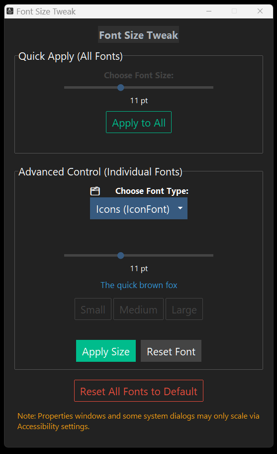

<!-- SEO Meta Tags -->
<meta name="description" content="FontSize Tweak is a free Windows tool to customize system font sizes like menu, title bar, and icon text without using display scaling.">
<meta name="keywords" content="change font size windows, windows ui font size, accessibility font tool, windows menu font size, fix small text windows 11, increase font size windows, windows tweak tool">
<meta name="author" content="admjski">

<!-- Open Graph Meta Tags -->
<meta property="og:title" content="FontSize Tweak – Resize Windows Fonts Without Scaling">
<meta property="og:description" content="A free, dark-mode utility to adjust Windows system fonts without changing DPI scaling.">
<meta property="og:image" content="https://uxillary.github.io/font-size-tweak/screenshot.png">
<meta property="og:url" content="https://uxillary.github.io/font-size-tweak">
<meta property="og:type" content="website">

<!-- Twitter Meta Tags -->
<meta name="twitter:card" content="summary_large_image">
<meta name="twitter:title" content="FontSize Tweak – Resize Windows Fonts Without Scaling">
<meta name="twitter:description" content="Free Windows app to resize system fonts (title bar, icon text, menu) without scaling everything. Dark mode included.">
<meta name="twitter:image" content="https://uxillary.github.io/font-size-tweak/screenshot.png">

## Font Size Tweak

A clean, modern utility for Windows 10/11 to **adjust system font sizes** (title bars, menus, icons, and more) — no scaling required.

---

## Screenshot



---

## Features

- Adjust all system fonts or fine-tune each one:
  - Title Bar
  - Menu
  - Message Box
  - Icon
  - Status Bar
- Live preview + current font size detection
- Dark mode interface with accessible design
- Portable `.exe` – no install required
- One-click reset to defaults

---

## Download

👉 [Download the latest version](https://github.com/uxillary/font-size-tweak/releases)

> ⚠️ You may need to **log out and back in** for changes to take effect.

---

## How It Works

FontSize Tweak edits Windows registry font settings under:

````
"HKEY_CURRENT_USER\Control Panel\Desktop\WindowMetrics"
````

Built with Python + ttkbootstrap and packaged with PyInstaller.

---

## Support the Developer

If this tool helped your eyes (or your nan’s), consider [buying me a coffee](https://coff.ee/admjski).

---

## License

MIT License – use it, remix it, and share it.

Made by [@admjski](https://github.com/uxillary)
