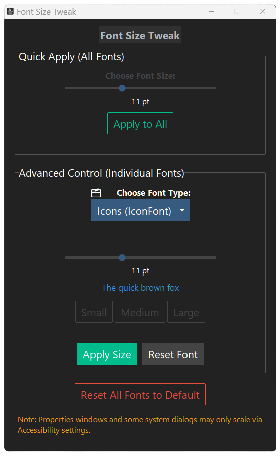

## Font Size Tweak

A clean, modern utility for Windows 10/11 to **adjust system font sizes** (title bars, menus, icons, and more) — no scaling required.

---

## Screenshot



---

## Features

- Adjust all system fonts or fine-tune each one:
  - Title Bar
  - Menu
  - Message Box
  - Icon
  - Status Bar
- Live preview + current font size detection
- Dark mode interface with accessible design
- Portable `.exe` – no install required
- One-click reset to defaults

---

## Download

👉 [Download the latest version](https://github.com/uxillary/font-size-tweak/releases)

> ⚠️ You may need to **log out and back in** for changes to take effect.

---

## How It Works

FontSize Tweak edits Windows registry font settings under:
```
HKEY_CURRENT_USER\Control Panel\Desktop\WindowMetrics
```

Built with Python + ttkbootstrap and packaged with PyInstaller.

---

## Support the Developer

If this tool helped your eyes (or your nan’s), consider [buying me a coffee](https://coff.ee/admjski).

---

## License

MIT License – use it, remix it, and share it.

Made by [@admjski](https://github.com/uxillary)
